# TrackBalance

**🚀 Demo Online:** [https://trackbalance123.netlify.app](https://trackbalance123.netlify.app)

Uma aplicação web para controle de finanças pessoais desenvolvida como projeto de aprendizado e portfólio.

## 📸 Capturas de Tela

| Desktop Home | Desktop Login | Desktop Otp |
|-----------------------|--------------------------|--------------------|
| [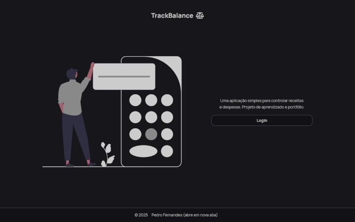](./screenshots/) | [](./screenshots/) | [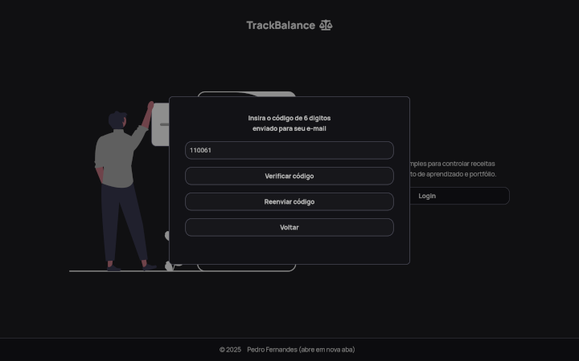](./screenshots)

| Desktop Dashboard Cima| Desktop Dashboard Baixo |
|-----------------------|--------------------------|
| [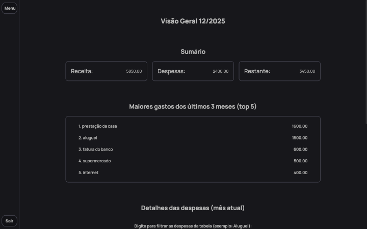](./screenshots/) | [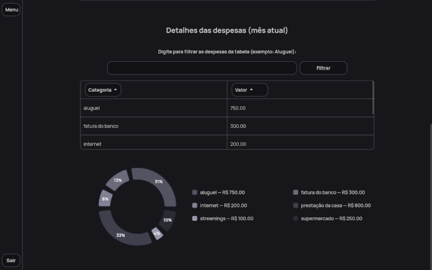](./screenshots/) |

| Desktop Sidebar| Desktop Modal |
|-----------------------|--------------------------|
| [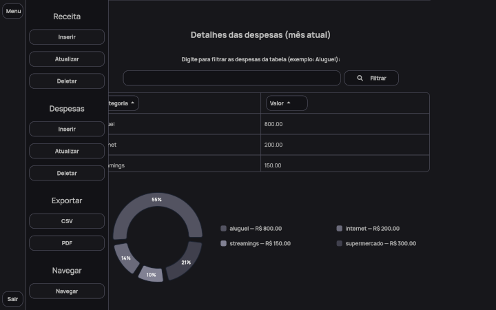](./screenshots/) | [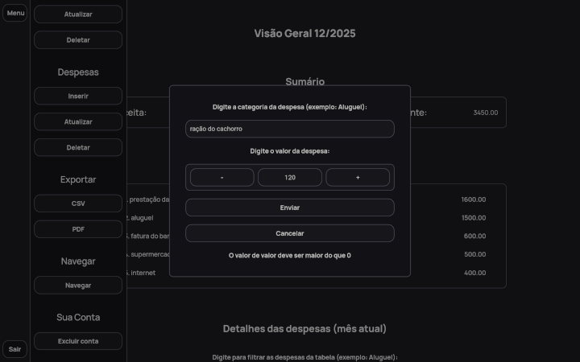](./screenshots/) |


| Mobile Dashboard Cima  | Mobile Dashboard Baixo | Mobile Home |
|-----------------------|--------------------------|-----------------
| [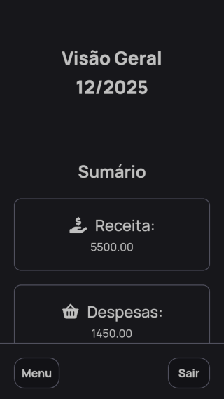](./screenshots/) | [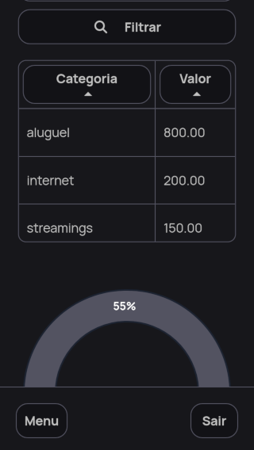](./screenshots/) | [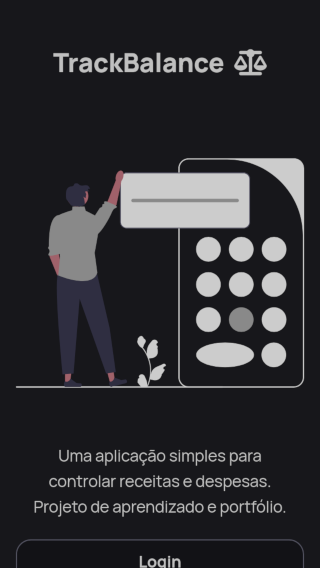](./screenshots/) |

| Mobile Sidebar  | Mobile Modal |
|-----------------------|--------------------------|
| [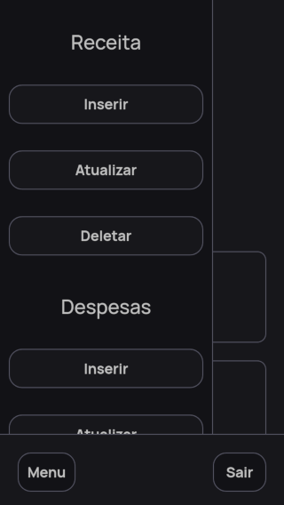](./screenshots/) | [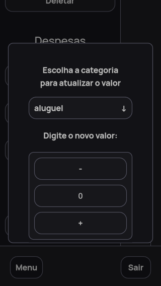](./screenshots/) |


## ✨ Funcionalidades

- **Gestão de Receitas**: Inserir, atualizar e deletar receita mensal (uma única receita por mês)
- **Gestão de Despesas**: Inserir, atualizar e deletar múltiplas despesas (categorias únicas por mês)
- **Navegação entre Meses**: Acessar e manipular dados de meses anteriores e futuros (dentro dos limites estabelecidos)
- **Exportação de Dados**: Exportar dados do mês atual para CSV e PDF
- **Dashboard Resumido**: Visualização rápida do saldo e despesas recentes
- **Exclusão de Conta**: Remoção completa dos dados do usuário
- **Gestão dos Meses**:
  - Não cria meses desnecessários (apenas cria quando há dados reais)
  - Detecta "meses vazios" no histórico e oferece preenchimento automático
  - Sempre garante que o mês atual existe, copiando dados do último mês válido
  - Cria meses intermediários automaticamente durante a navegação nos meses (caso queira navegar para um mês que não existe)

## 🛠️ Tecnologias Utilizadas

- **Frontend**: React + Vite
- **Backend**: Supabase (Banco de dados e autenticação OTP)
- **Roteamento**: React Router
- **Gráficos**: Recharts
- **Exportação PDF**: jsPDF + AutoTables
- **Estilização**: CSS

## ♿ Acessibilidade

Desenvolvi este projeto com grande foco em acessibilidade:

### 🎯 Porque Componentes Customizados?
Embora este projeto seja para portfólio, ele é também (até mais) de aprendizado. Como tal, queria aprender a criar componentes "substitutos" aos elementos nativos e acima de tudo aprender a deixar-los acessíveis.

### 🎯 Componentes Customizados
- **Modal Context** - substitui alertas/confirms nativos
- **CustomSelect** - acessível com focus trap, type-ahead e anuncios
- **NumberInput** - mantive o input type number nativo, adicionei botões + e -, escondi e desativei o spinner
- **FormModal** - modal genérico para formulários

### 🔧 Hooks  
- **useAriaActionStatusAnnouncer** - gerencia live regions para feedback em tempo real
- **useFormFieldValidation** - validações customizadas com feedback acessível

### 🧪 Testes de Acessibilidade

#### 🔍 Manuais
- Navegação completa via teclado (todas as funcionalidades)
- Teste com leitor de tela Orca + navegador Firefox (Linux)
- Navegação por landmarks e headings
- Teste de focus trap em modais
- Validação de contrastes de cor

#### ⚙️ Ferramentas de Teste
- Lighthouse
- WAVE Evaluation Tool
- IBM Equal Access Accessibility Checker
- Ferramenta nativa de Acessibilidade do Firefox

## 🗄️ Estrutura do Banco de Dados

- **months**: Controle de meses por usuário
- **incomes**: Receitas mensais (uma por mês)
- **expenses**: Despesas mensais (categorias únicas)
- **user_flags**: Controle de navegação entre meses - enquanto flags forem null usuario não colocou dados uteis (receita e ou despesas). Não cria registro de mês.

## 🚀 Como Executar

### Pré-requisitos
- Node.js instalado
- Conta no [Supabase](https://supabase.com)

### Instalação

1. Clone o repositório:
```bash
git clone https://github.com/pedrobfernandes/trackbalance.git
cd trackbalance
```
2. Instale as dependências:
```bash
npm install
```
3. Configure as variáveis de ambiente:
- Crie um arquivo .env na raíz do projeto
- Adicione as suas credencias do Supabase:
```bash
VITE_SUPABASE_URL=sua_url_do_supabase
VITE_SUPABASE_ANON_KEY=sua_chave_anon_publica
VITE_SUPABASE_DELETE_ACCOUNT_URL=url_da_edge_function_para_excluir_conta
```
4. Configure o banco de dados
- Crie um projeto no Supabase
- Execute o script que está na pasta `database/setup.sql` no editor SQL do projeto
- Crie uma Edge Function com o nome: `delete-user-account`
- Configure a Edge Function `delete-user-account` usando o arquivo da pasta `database/delete-user-account/index.ts`
- No dashboard do Supabase, procure pelos templates de Email, e use o template da pasta `email-template` para "Confirm sign up" e "Magic link"
5. Execute a aplicação
```bash
npm run dev
```

### 📝 Notas Importantes
- A autenticação é por OTP (código enviado para o email)
- Usei o mesmo template de email para  "Confirm Signup" e "Magic Link", caso contrário, no segundo login, o Supabase envia Magic Link ao invés de código
- Como iniciante, configurei a Edge Function (e basicamente tudo) pelo dashboard do Supabase, sem usar supabase-cli ou outro método
- Todos os testes de acessibilidade foram feitos no Firefox (linux) + ORCA apenas. Não tenho acesso a outros sistemas nem leitores de tela
