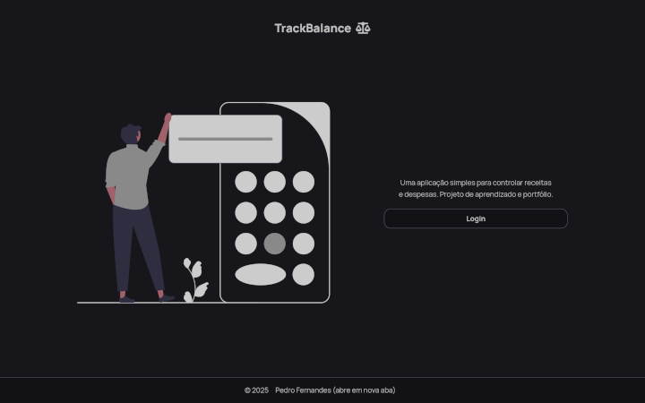
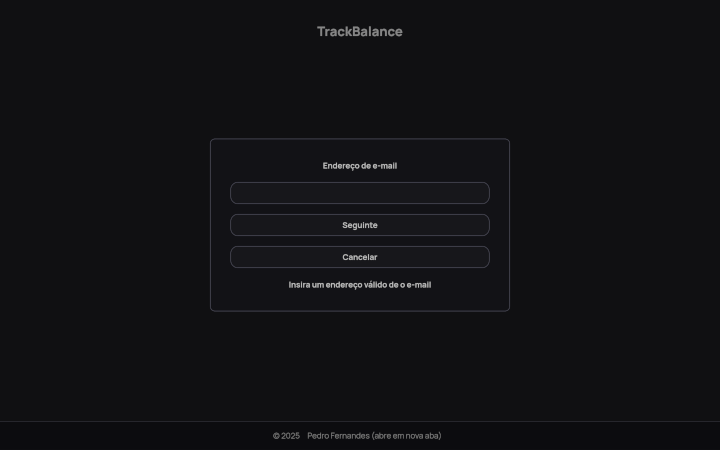
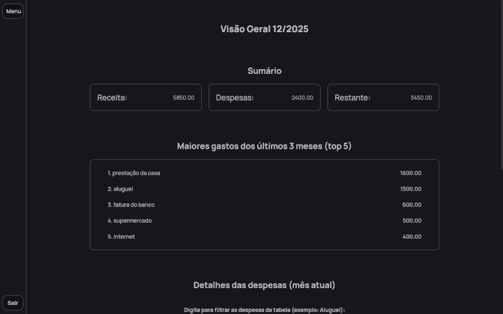
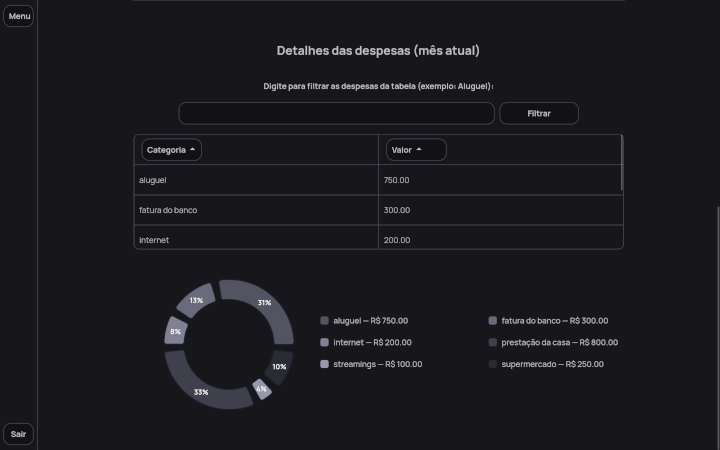

# TrackBalance

Aplicação de gestão financeira pessoal com autenticação, persistência de dados e forte foco em acessibilidade (WCAG).

🔗 **Demo:** https://trackbalance123.netlify.app

---

## 🚀 Principais Destaques

* Autenticação via OTP com Supabase
* CRUD completo com persistência de dados
* Dashboard financeiro (receitas, despesas e saldo)
* Exportação de dados (CSV e PDF)
* Navegação entre meses com atualização dinâmica

---

## 🛠️ Tecnologias

* React
* Vite
* Supabase (database + autenticação)
* React Router
* Recharts
* jsPDF + AutoTables
* CSS

---

## 🧠 Aprendizados

Durante o desenvolvimento deste projeto, aprofundei conhecimentos em:

* Implementação de autenticação e fluxo de usuário com Supabase
* Gerenciamento de estado e sincronização de dados com backend
* Construção de componentes acessíveis sem bibliotecas externas
* Aplicação prática de padrões WAI-ARIA

---

## ♿ Acessibilidade

Este projeto foi desenvolvido com foco prático em acessibilidade, seguindo diretrizes WCAG e padrões WAI-ARIA.

### ✔️ Implementado

* Navegação completa por teclado
* Gerenciamento de foco (incluindo focus trap em modais)
* Uso de ARIA (aria-live, estados, roles)
* Testes com leitor de tela (Orca + Firefox)
* HTML semântico e landmarks

### 🧩 Componentes customizados

* Modal acessível (substituindo alert/confirm)
* Select com typeahead
* Input numérico com controles customizados
* Sistema de feedback com aria-live

---

## 🧪 Testes de Acessibilidade

### 🔍 Manuais

* Navegação completa por teclado
* Testes com leitor de tela (Orca + Firefox)
* Verificação de foco e landmarks

### ⚙️ Ferramentas

* Lighthouse
* WAVE
* IBM Equal Access
* Firefox Accessibility Tools

---

## ⚠️ Observações Técnicas

Durante o desenvolvimento, foram implementados dois tipos de modais:

- Modaal de formulário (utilizado para entrada de dados)
- Modal customizado para substituir `alert()` e `confirm()` do navegador

### Comportamento com leitor de tela

Ao testar com leitor de tela (Orca + Firefox), identifiquei um comportamento inconsistente relacionado ao fluxo de foco e anúncio de estado ao interagir com modais a partir da barra lateral.

Ao fechar o modal, o foco retornava corretamente ao botão de menu. No entanto, em alguns cenários, o leitor de tela não anunciava corretamente a mudança de estado ("expandido") ao reabrir a interface.

Como ajuste, optei por modificar o fluxo da interface, evitando o fechamento automático da barra de ações ao abrir modais, garantindo maior consistência na navegação e no feedback ao usuário.

### Limitação conhecida (modal customizado)

O modal utilizado como substituto de `alert()` e `confirm()` apresenta uma limitação:

- O retorno de foco não é tratado de forma totalmente genérica
- O comportamento funciona corretamente neste projeto devido ao contexto da interface (uso recorrente do botão de menu), mas depende dessa estrutura

Além disso, a implementação inicial utilizava um pequeno atraso (`setTimeout`) para mover o foco do container do modal para o botão de ação.

Essa abordagem foi posteriormente identificada como desnecessária e refinada em projetos seguintes, com uma gestão de foco mais consistente e alinhada às boas práticas de acessibilidade.

---

## 📸 Preview

| Desktop Home | Desktop Login |
|-----------------------|--------------------------|
| [](./screenshots/desktop1.png) | [](./screenshots/desktop2.png)

| Desktop Dashboard Cima| Desktop Dashboard Baixo |
|-----------------------|--------------------------|
| [](./screenshots/desktop4.png) | [](./screenshots/desktop5.png) |

---

## 🚀 Como Executar

### Pré-requisitos
- Node.js instalado
- Conta no [Supabase](https://supabase.com)

### Instalação

1. Clone o repositório:
```bash
git clone https://github.com/pedrobfernandes/trackbalance.git
cd trackbalance
```
2. Instale as dependências:
```bash
npm install
```
3. Configure as variáveis de ambiente:
- Crie um arquivo .env na raíz do projeto
- Adicione as suas credencias do Supabase:
```bash
VITE_SUPABASE_URL=sua_url_do_supabase
VITE_SUPABASE_ANON_KEY=sua_chave_anon_publica
VITE_SUPABASE_DELETE_ACCOUNT_URL=url_da_edge_function_para_excluir_conta
```
4. Configure o banco de dados
- Crie um projeto no Supabase
- Execute o script que está na pasta `database/setup.sql` no editor SQL do projeto
- Crie uma Edge Function com o nome: `delete-user-account`
- Configure a Edge Function `delete-user-account` usando o arquivo da pasta `database/delete-user-account/index.ts`
- No dashboard do Supabase, procure pelos templates de Email, e use o template da pasta `email-template` para "Confirm sign up" e "Magic link"
5. Execute a aplicação
```bash
npm run dev
```

---

## 🧠 Decisão de Implementação

Este projeto prioriza aprendizado prático, incluindo a implementação manual de componentes acessíveis ao invés do uso de bibliotecas prontas, com base no WAI-ARIA Authoring Practices.
